# FaceForge

FACS-based facial animation with full-body anatomy visualization.

FaceForge renders anatomically accurate 3D models of the human head and body using BodyParts3D (BP3D) STL meshes. Facial expressions are driven by the Facial Action Coding System (FACS), with 12 Action Units controlling muscle contraction, jaw movement, eye tracking, and skin deformation. The full-body extension adds a complete skeleton (~200 bones), muscles (~500 structures), organs, vasculature, and brain -- all deformable via a delta-matrix soft tissue skinning system with dual quaternion blending.

## Application

<p align="center">
  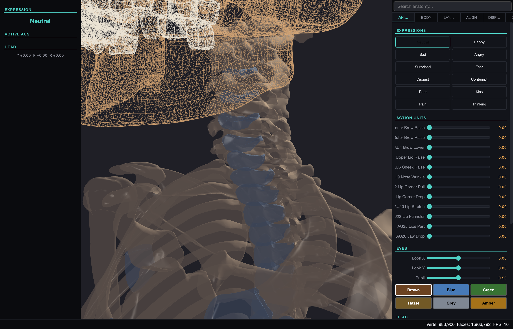
</p>

Interactive desktop application with real-time OpenGL rendering, expression presets, Action Unit sliders, and layered anatomy visualization. The left panel shows active expression state, the center viewport renders the 3D scene with orbit camera controls, and the right panel provides tabbed controls for animation, body poses, layer visibility, and export.

<p align="center">
  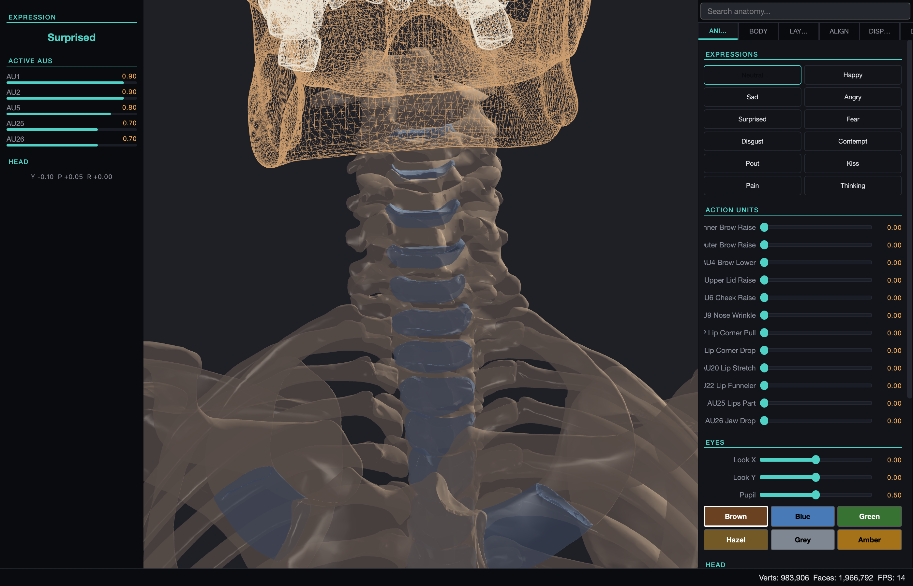
  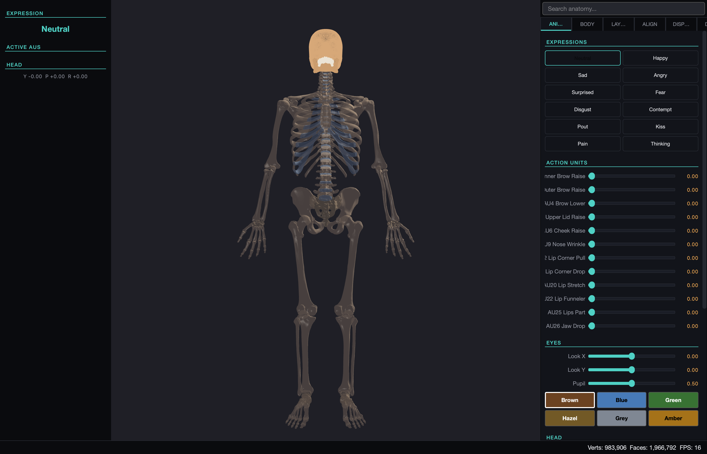
</p>

*Left: Surprised expression with jaw drop and active Action Units. Right: Full body skeleton from the front with complete arms and legs.*

<p align="center">
  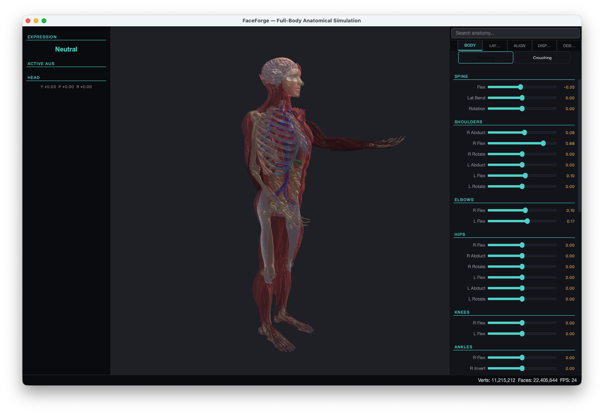
</p>

Full body view with skeleton, muscles, organs, and vasculature all visible simultaneously. Over 500 anatomical structures rendered in real time with per-group coloring.

### Render Modes

17 render modes across clinical, illustration, and creative styles:

<p align="center">
  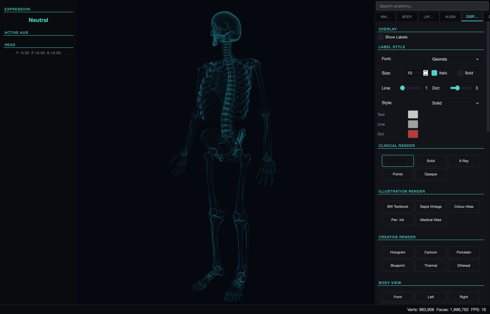
  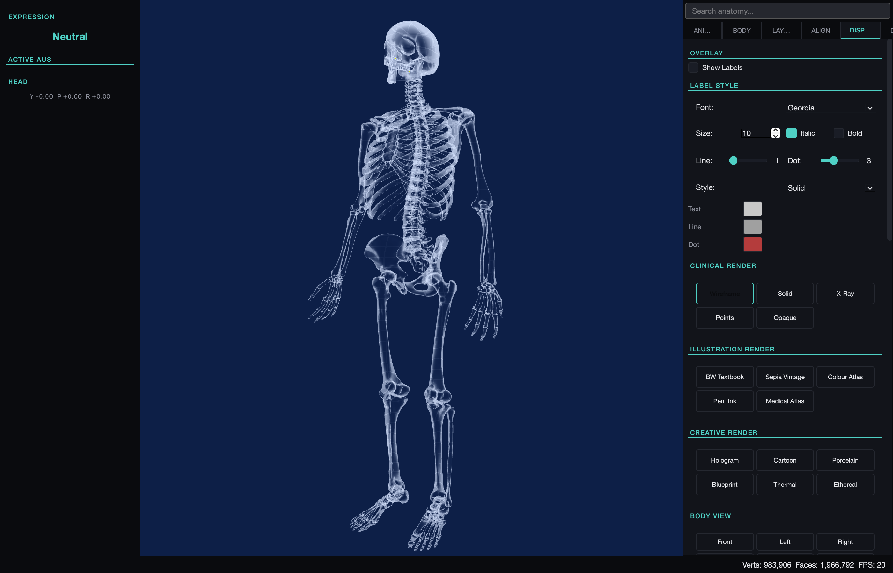
</p>

*Left: Hologram mode with sci-fi cyan glow effect. Right: Blueprint mode showing full body skeleton on deep blue.*

<p align="center">
  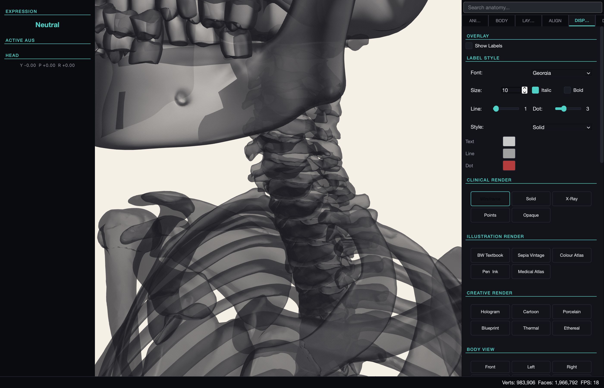
  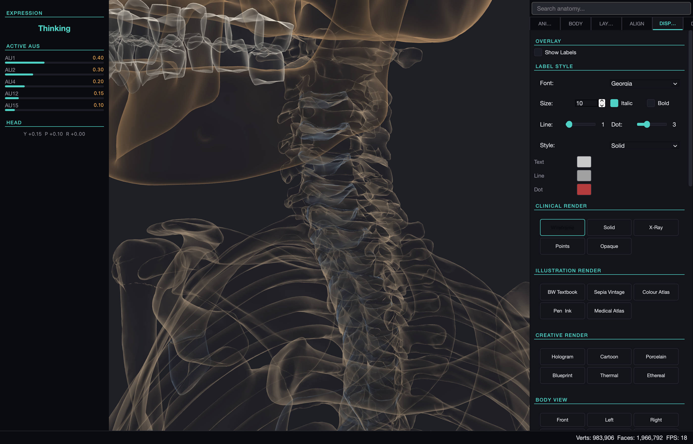
</p>

*Left: B&W Textbook illustration style on warm paper background. Right: X-Ray mode with translucent anatomy and "Thinking" expression.*

### Anatomical Layers & Labels

<p align="center">
  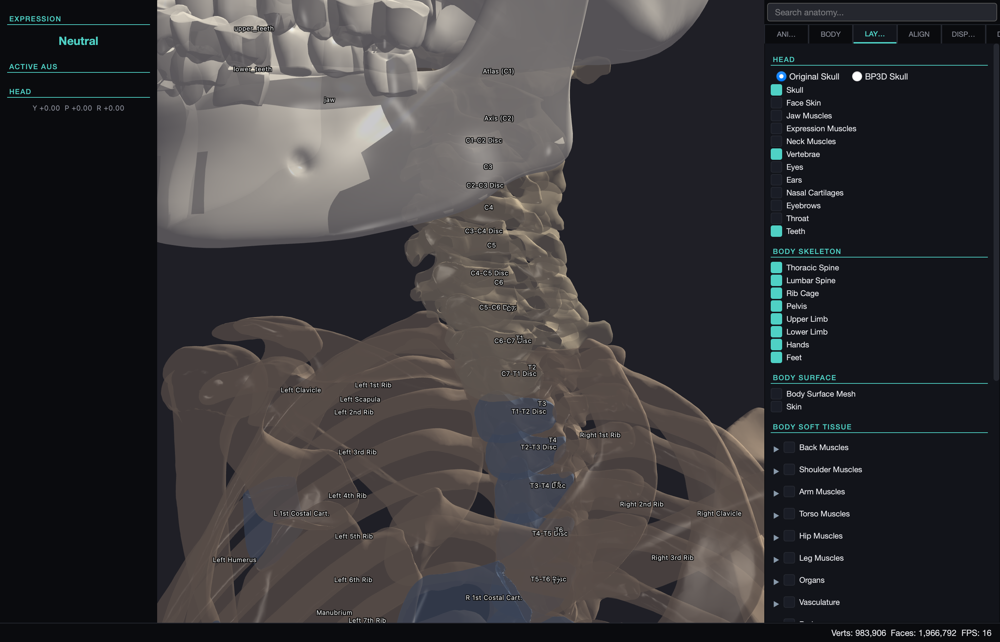
</p>

Color-coded head anatomy with structure labels. The Layers tab (right) provides toggles for each anatomical system: skull, face, jaw/expression/neck muscles, vertebrae, eyes, ears, and more.

<p align="center">
  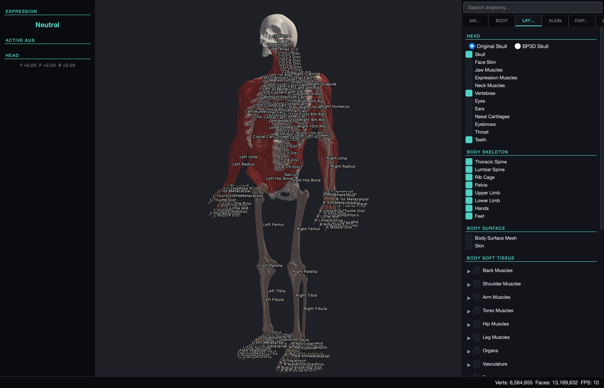
  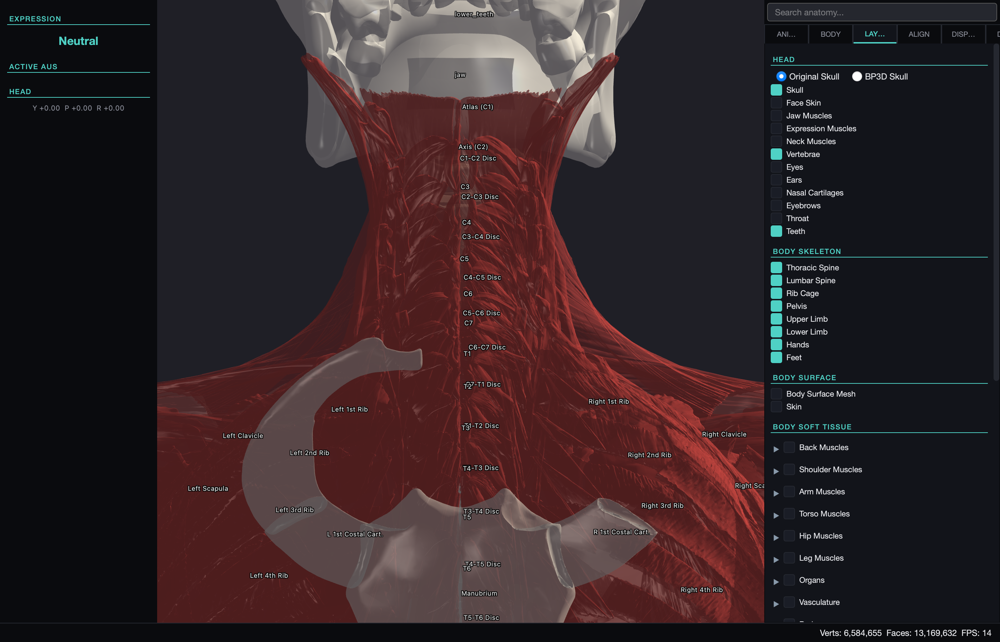
</p>

*Left: Full body with ~170 muscle structures (back, shoulder, arm, torso) labeled over the skeleton. Right: Head front close-up showing jaw, expression, and neck musculature with individual muscle labels.*

### Body Poses & Animation

<p align="center">
  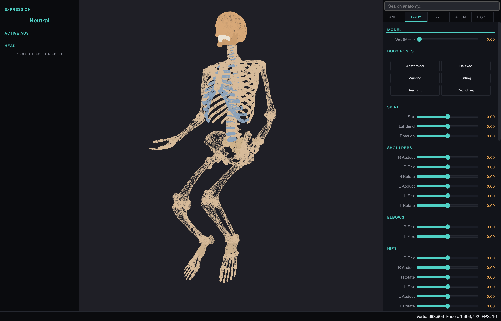
</p>

Wireframe sitting pose with the Body tab showing 6 pose presets and per-joint sliders for spine, shoulders, elbows, hips, knees, and more.

### Virtual Scanner

The built-in virtual scanner generates cross-section images using tiled ray-triangle intersection with Moller-Trumbore testing. It supports 5 imaging modes (CT, MRI T1, MRI T2, X-ray, Anatomical) and 3 anatomical orientations (axial, coronal, sagittal).

<p align="center">
  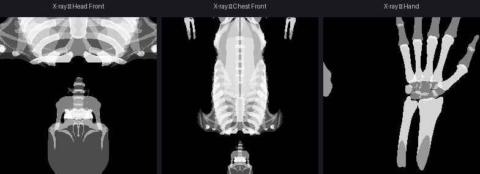
</p>

X-ray projections using Beer-Lambert absorption: head, chest (showing rib cage, spine, and clavicles), and hand with individual phalanges, metacarpals, and carpals resolved.

<p align="center">
  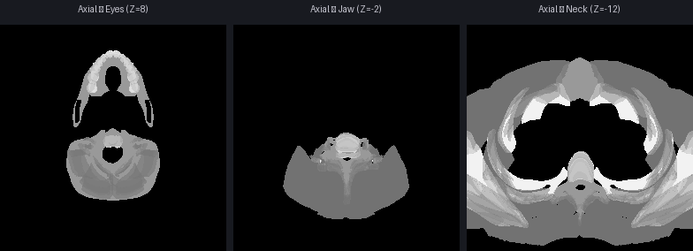
</p>

CT axial slices through the head at eye, jaw, and neck levels. Bone appears bright, soft tissue intermediate, and air dark -- matching real CT imaging conventions.

<p align="center">
  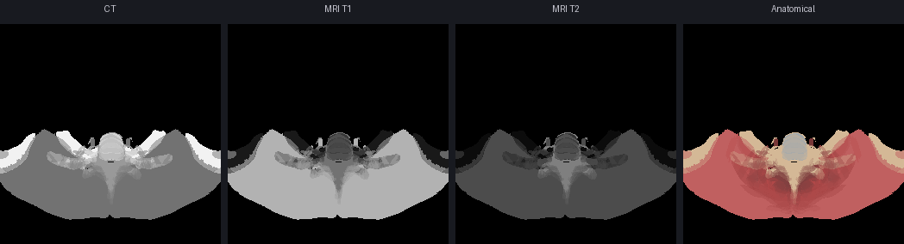
</p>

The same cross-section rendered in four modes: CT (bone-bright), MRI T1 (fat-bright), MRI T2 (fluid-bright), and Anatomical (original mesh colors). Each mode uses tissue-specific intensity tables with 13 tissue classifications.

<p align="center">
  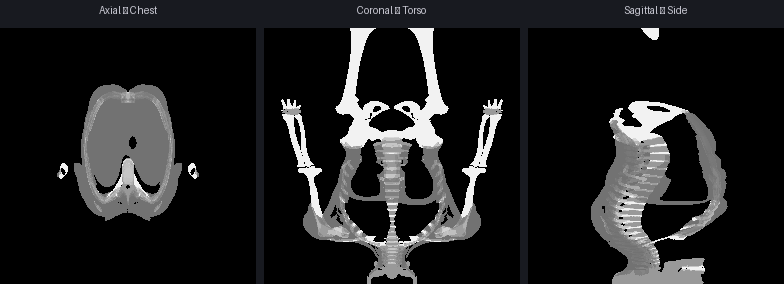
</p>

Body cross-sections in all three orientations: axial (chest level), coronal (front view showing ribs and pelvis), and sagittal (side profile of the spine).

## Gallery

### Skull

<p align="center">
  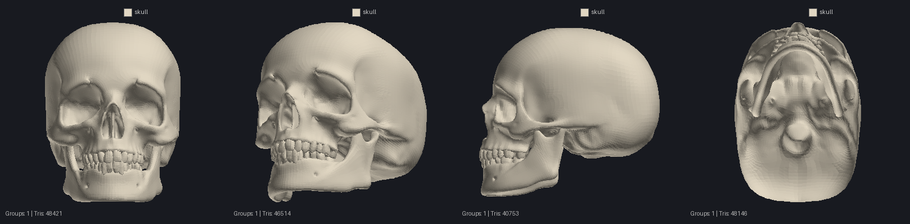
</p>

High-fidelity skull model with cranium, mandible, and teeth rendered from front, 3/4, side, and top-down views.

### Head Anatomy

<p align="center">
  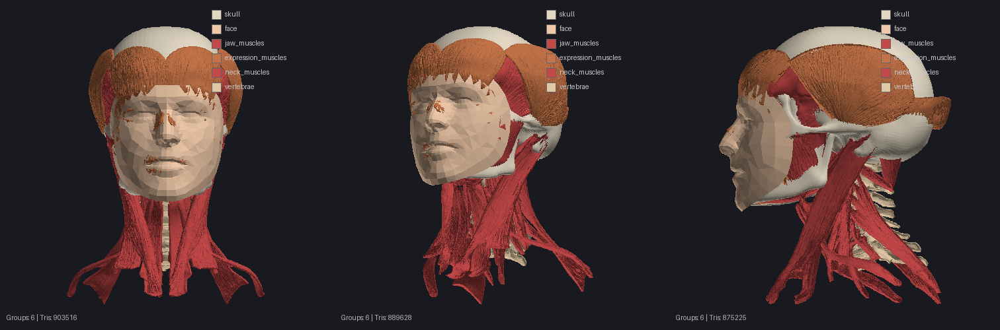
</p>

Multi-layered head anatomy showing skull, face mesh, jaw muscles (22), expression muscles (38), neck muscles (36), facial features, and cervical vertebrae -- all rendered simultaneously with per-group coloring and depth-interleaved sorting.

### Head Rotation

<p align="center">
  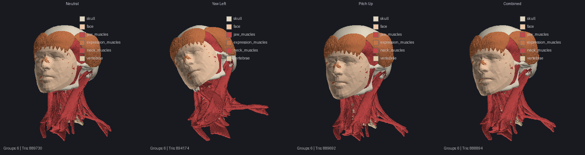
</p>

Head rotation distributed across cervical vertebrae with constraint solving. Supports yaw, pitch, and roll with realistic neck deformation and muscle tracking.

### Full Body Skeleton

<p align="center">
  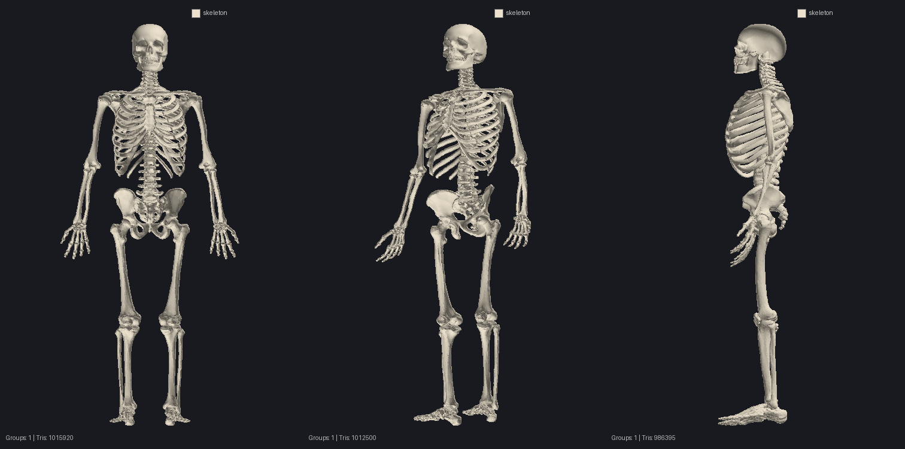
</p>

Complete skeletal system: skull, cervical/thoracic/lumbar spine with individual vertebrae, rib cage, pelvis, upper limbs (clavicle, scapula, humerus, radius, ulna), lower limbs (femur, patella, tibia, fibula), hands (54 bones), and feet (54 bones).

### Anatomical Layers

<p align="center">
  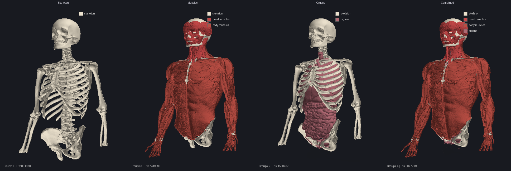
</p>

Progressive anatomy visualization: skeleton alone, skeleton with muscles (back, shoulder, arm, torso), skeleton with organs (52 structures including heart, lungs, liver, kidneys), and all layers combined.

### Head Anatomy Layers

<p align="center">
  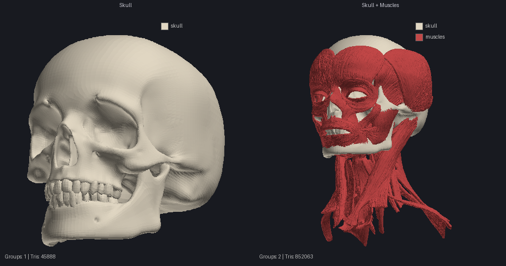
</p>

Side-by-side comparison of the skull alone versus skull with jaw, expression, and neck musculature overlaid.

### Body Poses

<p align="center">
  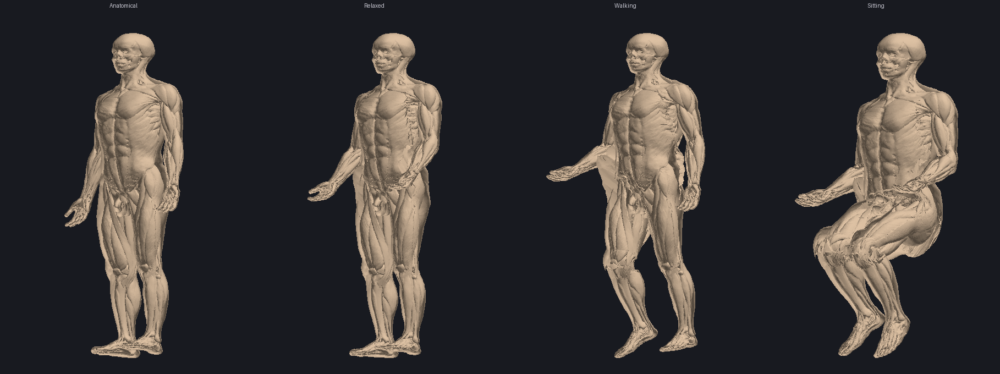
</p>

Soft-tissue deformation with delta-matrix skinning: anatomical rest pose, relaxed standing, walking, and sitting positions. The skinning system uses multi-chain binding with cross-chain blending and neighbor-stretch clamping.

## Architecture

Built in Python with:

- **PySide6 (Qt 6)** -- Desktop GUI with tabbed control panel
- **PyOpenGL** (OpenGL 3.3 core profile) -- GPU-accelerated Phong-lit rendering
- **NumPy** -- All vertex math, matrix operations, and skinning computations
- **BodyParts3D STL files** -- 934 binary STL meshes for anatomical structures

### GUI Layout

```
[InfoPanel | GLViewport | ControlPanel]
```

- **InfoPanel** (left) -- Project info and display settings
- **GLViewport** (center) -- Interactive 3D rendering with orbit camera controls
- **ControlPanel** (right, 6 tabs):
  - **Animate** -- Action Unit sliders, expression presets, head rotation, eye gaze
  - **Body** -- Body pose presets, limb articulation, breathing, gender morphing
  - **Layers** -- Visibility toggles for each anatomical system
  - **Align** -- Face/skull registration controls
  - **Display** -- Render mode (solid/wireframe/point), materials, lighting, export
  - **Debug** -- Technical diagnostics and state inspection

## Features

### Facial Animation (FACS)
- 12 Action Units: AU1 (Inner Brow Raise), AU2 (Outer Brow), AU4 (Brow Lower), AU5 (Upper Lid), AU6 (Cheek Raise), AU9 (Nose Wrinkle), AU12 (Lip Corner Pull), AU15 (Lip Corner Drop), AU20 (Lip Stretch), AU22 (Lip Funneler), AU25 (Lips Part), AU26 (Jaw Drop)
- 12 expression presets: neutral, happy, sad, angry, surprised, fear, disgust, contempt, pout, kiss, pain, thinking
- Jaw mechanics with TMJ hinge and dynamic pivot rotation
- Eye tracking with gaze direction control

### Auto-Animation
- Auto-blink with realistic timing cycles
- Auto-breathing with chest expansion and facial motion
- Micro-expressions (subtle fleeting expressions)
- Speech-coordinated mouth shapes

### Full-Body Systems
- **Skeleton**: ~200 STL bones across 8 regions (spine, ribs, pelvis, upper/lower limbs, hands, feet)
- **Muscles**: ~500 individual structures (back, shoulder, arm, torso, hip, leg, jaw, expression, neck)
- **Organs**: 52 structures (heart, lungs, liver, brain, kidneys, etc.)
- **Vasculature**: 50 structures (arteries, veins, capillaries)
- **Brain**: 80 structures with detailed region definitions

### Body Animation
- 6 pose presets: anatomical, relaxed, walking, sitting, reaching, crouching
- Spine flex/bend/rotation distributed across individual vertebrae
- Full limb articulation with physiological joint limits
- Rib cage breathing animation
- Gender morphing (body surface interpolation)

### Soft Tissue Deformation
- Delta-matrix skinning with dual quaternion blending
- Multi-chain binding (spine, ribs, arms, legs, hands, feet)
- Cross-chain blending at boundary regions
- Neighbor-stretch clamping to prevent artifacts
- Boundary smoothing for seamless chain transitions

### Scene Modes
- **Examination mode**: Body supine on surgical table
- **Dance studio mode**: Body standing upright
- Animated transitions between modes (wake up / lie down)
- Cutaway cross-section visualization with adjustable clip plane

### Virtual Scanner
- Cross-section imaging via ray-triangle intersection
- Tissue type classification in 2D cross-sections
- Tiled 16x16 ray-casting for performance
- Adjustable scan plane position and orientation

### Anatomy Education and Assessment
- Exam items generated from the FMA ontology, never authored by hand: identification
  (923 structures), body system, laterality, ontological classification and
  containment, plus a negative "which is NOT part of X" form
- Radiological identification: name the tagged structure on a simulated CT/MRI slice
- Distractors drawn from anatomical neighbours (FMA siblings, cousins, shared
  containing whole) so items discriminate rather than being guessable
- SM-2 spaced repetition with per-item history, and curricula derived from the
  anatomy configs
- **Every item carries provenance and a `verified` flag.** Items that cannot be
  traced to real data are excluded from exam mode, and clinical vignettes are
  refused unless they carry a citation — see `src/faceforge/anatomy/README.md`
  for what this dataset can and cannot support

### Export
- **Stills**: true-resolution offscreen FBO rendering at an arbitrary requested
  size, bounds-checked against the driver's texture/renderbuffer limits. This
  renders at the target size rather than upscaling a window grab
- **Video**: MP4 via FFmpeg or GIF via Pillow
- **Meshes**: OBJ, PLY, STL and binary glTF 2.0 (GLB) with baked world transforms
- **Provenance in exports**: glTF carries the required BodyParts3D attribution
  plus per-structure FMA identifiers and preferred labels; every format also
  writes a machine-readable `.provenance.json` sidecar. STL cannot carry
  per-structure identity and says so
- **Medical imaging**: DICOM (CT Image Storage) and NIfTI-1 from the virtual
  scanner, with geometry that round-trips to under 1e-4 mm. Pixel-value
  semantics are declared honestly rather than presented as calibrated
  Hounsfield units — see the limitations note in `docs/headless_cli.md`
- **Turntable**: 360-degree rotation capture

### Headless Use and Scripting
- `faceforge-cli render --state FILE --out PNG` — render a scene from a saved
  `SceneState`; byte-identical across runs, so a figure regenerates from a
  committed file
- `faceforge-cli batch|scan|export|verify-assets|list-layers`
- A `Session` API (`faceforge.session`) for use from Python with no GUI and no
  display. See `docs/headless_cli.md`
- `faceforge` (no `-cli`) remains the GUI entry point and is unchanged

## Requirements

- Python 3.11+
- numpy >= 1.24
- PyOpenGL >= 3.1.7
- PySide6 >= 6.6
- glfw >= 2.6
- BodyParts3D STL files (symlinked at `assets/stl/`)

SciPy is a **required** dependency: `body/soft_tissue.py` builds cached CSR neighbour
operators with it, which is a 5.2× speedup on the per-frame animation path (417.5 →
80.2 ms/frame at 199,363 vertices). The code still falls back to `np.add.at` if SciPy
is missing, producing bitwise-identical positions 5.2× slower.

Optional: pytest, pytest-qt (dev), glslang (dev — compiles the shaders in CI without a
GPU, `conda install -c conda-forge glslang`), Pillow (image tools), FFmpeg (video export).

## Installation

```bash
pip install -e .
# Or with dev dependencies:
pip install -e ".[dev]"
```

## Running

```bash
faceforge
# Or:
python -m faceforge.app
```

Both of the above require the editable install above (it is what puts `faceforge` on
`sys.path`). To run straight from a clone without installing anything:

```bash
PYTHONPATH=src python -m faceforge.app
```

The app needs a real window-server session: it creates a `QOpenGLWidget`, so it will
not start over SSH or under `QT_QPA_PLATFORM=offscreen` (you will see
`QOpenGLWidget is not supported on this platform`).

## Project Structure

```
faceforge/
  src/faceforge/
    app.py                 # Application entry point
    constants.py           # Paths, mesh constants, camera presets
    anatomy/               # FACS engine, jaw/expression/neck muscles, head rotation
    animation/             # Auto-blink, breathing, interpolation, presets
    body/                  # Skeleton, soft tissue skinning, organs, brain, vasculature
    coordination/          # Loading pipeline, scene building, simulation loop
    core/                  # Scene graph, state management, math, events, mesh
    export/                # GLB export, video/screenshot capture
    loaders/               # STL parser, batch loader, asset manager
    rendering/             # OpenGL renderer, camera, shaders, orbit controls
    scanner/               # Cross-section virtual scanner
    scene/                 # Scene modes (examination, dance studio)
    ui/                    # Qt GUI: main window, control panel, tabs
  assets/
    config/                # JSON configs for muscles, skeleton, expressions
      muscles/             # Per-region muscle definitions (jaw, expression, neck, back, ...)
      skeleton/            # Per-region skeleton definitions (spine, ribs, limbs, ...)
    meshdata/              # Embedded mesh data (skull, face, landmarks)
    stl/                   # BodyParts3D STL files (934 binary meshes)
  tests/                   # pytest test suite
  tools/                   # Diagnostic, rendering, and image generation utilities
  pyproject.toml           # Build configuration
```

## Loading Pipeline

Assets are loaded in tiered phases to keep startup fast:

| Tier | Phase | Contents | When |
|------|-------|----------|------|
| 0 | Skull | Cranium, jaw, teeth from embedded data | Startup |
| 1 | Head | Jaw muscles, expression muscles, face features, neck, vertebrae | Startup |
| 2 | Skeleton | Thoracic/lumbar spine, ribs, pelvis, limbs, hands, feet (~200 STLs) | Startup |
| 3 | Muscles | Back, shoulder, arm, torso, hip, leg muscles (~500 structures) | On demand |
| 4 | Organs | 52 organ structures | On demand |
| 5 | Vascular/Brain | 50 vascular + 80 brain structures | On demand |

## Key Systems

- **FACS Engine**: Applies AU displacements to the 468-vertex MediaPipe face mesh with per-region vertex control
- **Head Rotation**: Yaw/pitch/roll distributed across C1-C7 cervical vertebrae with constraint solving
- **Neck Constraints**: Tension monitoring, soft-clamping, and dynamic thoracic compensation
- **Soft Tissue Skinning**: Delta-matrix system with dual quaternion blending for anatomically correct body deformation
- **Body Animation**: Spine flex/bend/rotation, limb articulation with joint limits, breathing cycle
- **Scene Graph**: Hierarchical node/mesh system with world matrix propagation
- **Simulation Loop**: Per-frame state interpolation with delta-time clamping

## Generating Showcase Images

Headless rendering is available for generating images without the GUI:

```bash
# Generate all README showcase images
python -m tools.generate_readme_images

# Visual skinning test with body poses
python -m tools.visual_skinning_test

# Head rotation test renders
python -m tools.head_rotation_test
```

## Attribution

Anatomical geometry is derived from **BodyParts3D**, © The Database Center for
Life Science (DBCLS), licensed under
[CC BY-SA 2.1 Japan](https://creativecommons.org/licenses/by-sa/2.1/jp/en/).

> BodyParts3D, © The Database Center for Life Science licensed under
> CC Attribution-Share Alike 2.1 Japan.

This credit is a condition of the licence and must be displayed by anything
that redistributes or publishes renders derived from these meshes — including
figures in papers, teaching material and exported images or video. Note that
CC BY-SA is a **share-alike** licence: derivative geometry inherits it.

Structures are cross-referenced to the Foundational Model of Anatomy in
`assets/config/fma_labels.json`, so a rendered structure can be cited by its
FMA identifier and preferred term rather than by FaceForge's display name.

FaceForge's own source code is separately licensed; see below.

## License

See project files for license information.
